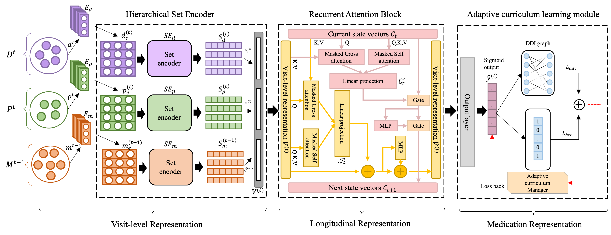

# SHAPE
This repository provides the code for [SHAPE: a Sample-adaptive Hierarchical Predication Network for Medication Recommendation]()
# Overview



## Data 
For a fair comparision, we use the same data and pre-processing scripts used in [COGNet](https://github.com/BarryRun/COGNet)

Please put the data into the [data](./data/) folder
  * records_final.pkl
  * voc_final.pkl
  * ehr_adj_final.pkl
  * ddi_A_final.pkl
  * ddi_mask_H.pkl
  * D_ICD_DIAGNOSES.csv
  * D_ICD_PROCEDURES.csv
  
## Environment
Please create the conda environment through yaml file

```
conda env create -f environment.yml
```
Please note that we trained our code on the Linux platform.

## Run the code
```
python main.py
```
we put the best model checkpoint in the [save_model](./save_model/) folder

## Contact
Please contact [csesicen@ust.hk](csesicen@ust.hk) for help or submit an issue.
## Citation
Please cite [SHAPE: A Sample-Adaptive Hierarchical
Prediction Network for Medication
Recommendation](https://ieeexplore.ieee.org/stamp/stamp.jsp?arnumber=10266699)
```
@article{liu2023shape,
  title={SHAPE: A Sample-adaptive Hierarchical Prediction Network for Medication Recommendation},
  author={Liu, Sicen and Wang, Xiaolong and Du, Jingcheng and Hou, Yongshuai and Zhao, Xianbing and Xu, Hui and Wang, Hui and Xiang, Yang and Tang, Buzhou},
  journal={IEEE Journal of Biomedical and Health Informatics},
  year={2023},
  publisher={IEEE}
}
```
